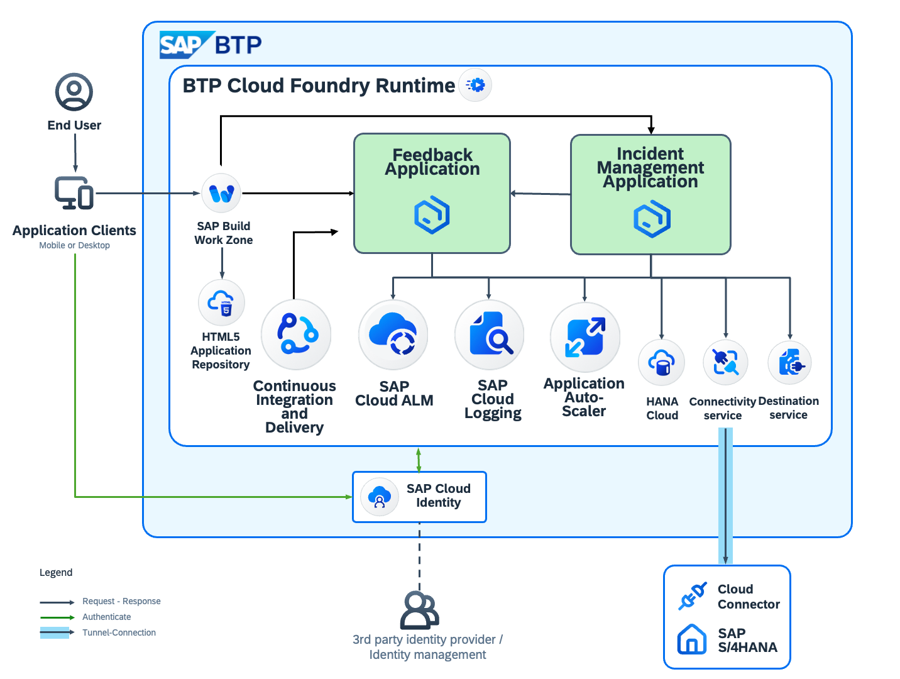
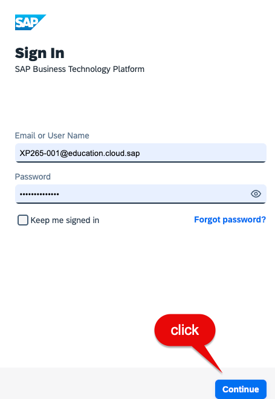
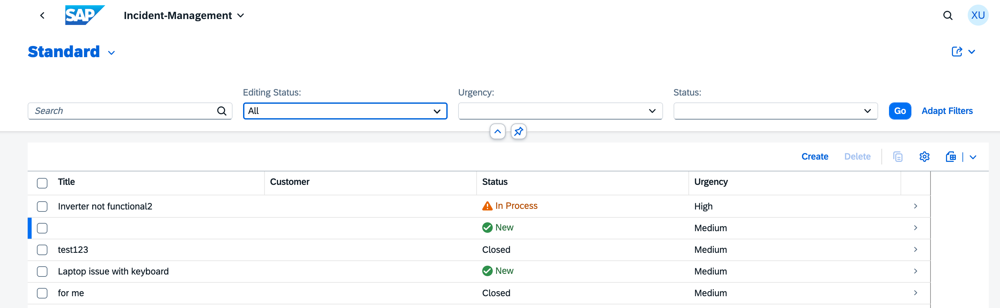
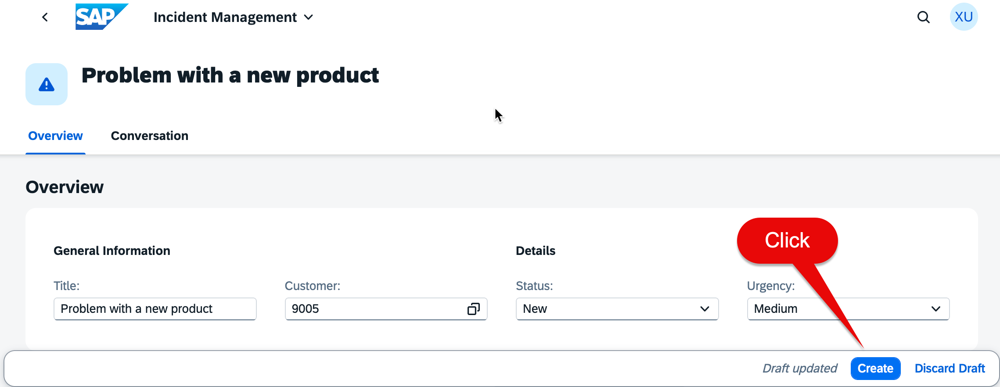
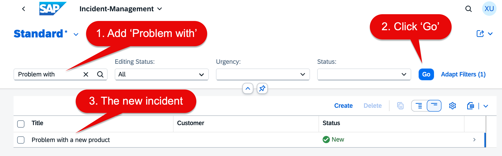

# Exercise 0 - General Information and Prerequisites (optional)

> [!IMPORTANT]
> The below information and Exercise 0 is provided for further Background information and not necessarily required to fullfill this hands on. 
>
> If you want to directly start, please go to the [Exercise 1 - Production Readiness Checks](../ex1/README.md).
>
> E.g. below you find information how to [Sign In](#start-here-and-get-access-to-the-backend-system-and-btp-cockpit) and [how to use the application](#start-here-to-explore-the-incident-management-application).

## Scenario Description And System Landscape

Get hands-on with a production-grade SAP Cloud Application Programming Model (CAP)-based Incident Management system running on SAP BTP! This isn't a toy demo - you'll operate a real multi-service application (incident-management + feedback service) integrated with enterprise SAP solutions including SAP HANA Cloud, SAP Workzone, Identity Management, and many more that employees actually use to report IT and facility issues.

Why this matters: You'll master the essential Day-2 operations toolkit - SAP Cloud ALM for monitoring, SAP Cloud Logging for troubleshooting, SAP Application Auto-Scaler for scaling, and SAP Continuous Integration and Delivery for deployments. Every technique directly applies to your production environments, giving you immediately actionable skills that separate successful deployments from struggling ones.

The architecture below shows the complete system (green = custom services, SAP icons = platform services). You'll focus on the highlighted core operational tools that drive operational excellence.

   

## Start here and get access to the Backend System and BTP Cockpit

The SAP BTP Cockpit serves as your mission-critical command center, providing centralized management, monitoring, and configuration capabilities across your entire BTP landscape. This unified dashboard gives administrators and developers real-time visibility into account structure, service health, application status, and resource usage metrics. It's the essential starting point for service provisioning, account governance, and system health monitoring that keeps your enterprise operations running smoothly.

#### Step 1. Start your Journey 

Open in your browser the [SAP Business Technology Platform - Cockpit](https://emea.cockpit.btp.cloud.sap/cockpit?idp=a8z641mqa.accounts.ondemand.com#/globalaccount/9e10042e-0fbd-42ed-8cbf-2905b95c6d99/accountModel&//?section=SubaccountsSection&view=TilesView)

You will get redirected to the "Sign In" page.

#### Step 2. Sign In

A "Sign In" screen will appear (if asked). Enter your credentials provided by your lab instructor and click on "Continue". Use the user assigned to your desk e.g. "XP265-001@education.cloud.sap"

   

#### Step 3. You will be redirected to the global account overview page as shown below

   

**Result**: You know how to log in to SAP Business Technology Platform and have a brief overview of the SAP BTP cockpit. 

Alternatively you can now directly start with [Exercise 1 - Production Readiness Check](../ex1/README.md) or you continue below to access and understand the app you are responsible for - the [Incident Management app](https://xp265-shared-4t2shozq.launchpad.cfapps.eu10.hana.ondemand.com/site?siteId=f7652fdf-d61e-4cec-95d9-bcd5e64fc13c#incidents-display?sap-ui-app-id-hint=saas_approuter_ukrs01.incidents&/?sap-iapp-state=TAS1LR6TOCWJTQLQQG421CCSSCBH610QPYEH7HF46).

## Start here to understand your target application

This chapter provides a brief overview of the Incident-Management application and walks through the key user journey you'll be supporting as an operator.

> [!NOTE]
> While exploring the application UI isn't mandatory for completing the hands-on exercises, understanding the user experience will give you valuable context for the operational scenarios you'll encounter and help you better interpret the monitoring data and logs you'll work with.

#### Step 1. Open the Incident-Management application

* Open the [Incident Management Application](https://xp265-shared-4t2shozq.launchpad.cfapps.eu10.hana.ondemand.com/site?siteId=f7652fdf-d61e-4cec-95d9-bcd5e64fc13c#incidents-display?sap-ui-app-id-hint=saas_approuter_ukrs01.incidents&/?sap-iapp-state=TAS1LR6TOCWJTQLQQG421CCSSCBH610QPYEH7HF46) to learn more about the incident .

You will get redirected to the **Incident-Management** overview page.

In the Incident-Management application overview you can search, filter and create an new incident. 

#### Step 2. Create an incident

* Click on the **Create** button in the Incident-Management application overview
* Fill out the title and customer in the General Information section and select a status and urgency in Details section, as shown in the screenshot and click **Create**. 

After successfully creating the incident, simply click the back button in your browser. The newly created incident should now appear in the list of incidents . 

* Click the navigation arrow above the application
* Enter _Problem with_ in the search field
* Click _GO_ to search and find the new created incident

**Result**: You've received a brief overview of the application covered in this course. 
In the next sections, you'll learn more about the application and how to deploy and monitor it.

## Summary

You have now completed the exercise and learned
 - How to login to the SAP Business Technology Platform (BTP) Cockpit 
 - What the Incident Management application is that this course is about.
 - How we can search, filter and create an incident.

Continue to - [Exercise 1 - Production Readiness Check](../ex1/README.md)
