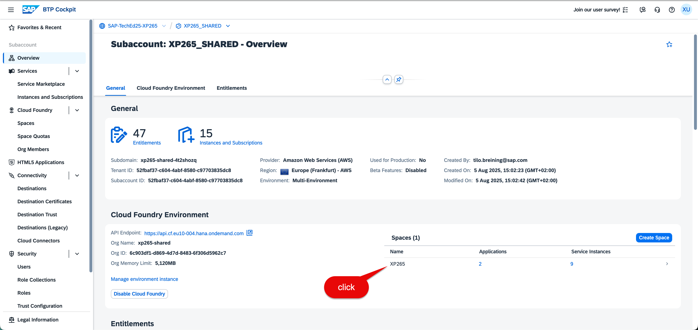
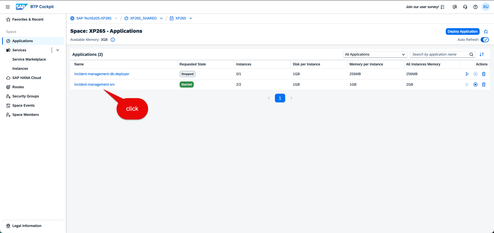
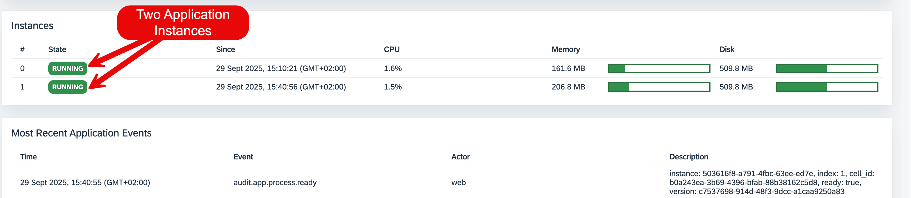
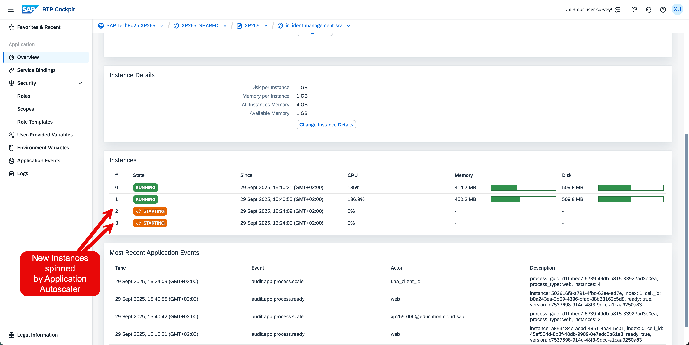
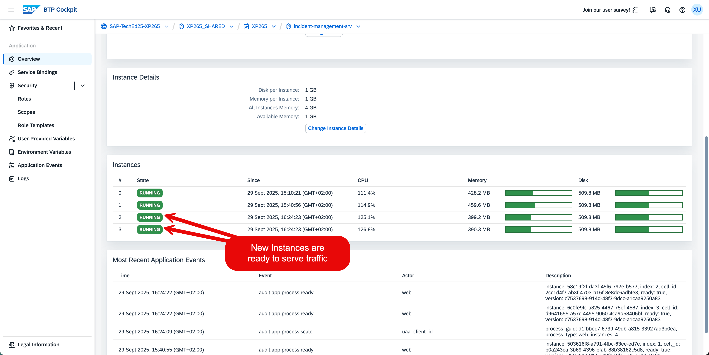

# Exercise 3 - Application Scaling 

**The Ultimate Stress Test: Proving Your System Can Handle the Storm**

Your observability dashboards are live, your monitoring is dialed in—but there's one final question that will make or break your public launch: *What happens when everyone tries to use your system at once?*

**Your Challenge:**
With go-live imminent, you need absolute confidence that your incident management application won't buckle under real-world load. Using SAP BTP's Application Autoscaler service, you'll simulate the traffic surge that inevitably follows any successful launch and verify your system's ability to scale gracefully under pressure.

**The Reality Check:**
Public launches create unpredictable traffic patterns. User adoption can spike 10x overnight, conference demos drive sudden load bursts, and viral adoption can overwhelm even well-planned capacity. Your NodeJS application and feedback microservice must automatically adapt—or risk becoming the very incident your users need to report.

**What You'll Prove:**
- Your scaling policies respond appropriately to load increases
- Application performance remains stable during scale-out events
- Resource utilization optimizes automatically as demand fluctuates
- Your observability tools accurately track scaling behavior in real-time

**The Moment of Truth:**
This isn't just about adding more instances—it's about proving your architecture can maintain service quality while dynamically right-sizing resources. When stakeholders ask "Can it handle our growth?", you'll have data-driven proof.

*Ready to stress-test your way to launch confidence? Let's see if your system is truly production-ready.*

## Exercise Background

Find a general description of the application you are responsible [here](../ex0/README.md#scenario-description-and-system-landscape)

Today, a major incident has occurred, drawing the attention of all employees. As a result, everyone is accessing the application simultaneously to view the incident. This sudden surge in traffic has caused a significant spike in the application's resource usage (CPU)

To announce the incident, employees were notified with the following message:

> We would like to inform you that a major incident has occurred and is currently being addressed. The Incident Management Application Portal is available for you to view or report any related issues.  
>
> Please click the [Incident Management Application](https://xp265-shared-4t2shozq.launchpad.cfapps.eu10.hana.ondemand.com/site?siteId=f7652fdf-d61e-4cec-95d9-bcd5e64fc13c#incidents-display?sap-ui-app-id-hint=saas_approuter_ukrs01.incidents&/?sap-iapp-state=TAS1LR6TOCWJTQLQQG421CCSSCBH610QPYEH7HF46) to learn more about the incident.
> 
>We appreciate your patience and cooperation as we work to resolve this matter.

A few hours, hundreds (maybe thousands) of employees started reporting incidents by
accessing the Incident Management application (via the link provided) at the same time. As a result, a huge number of
requests (traffic) hit the application, leading to a sudden spike in applications resource
usage (CPU, memory)

> For the purpose of this exercise, the lab instructor will simulate the traffic spike by sending multiple requests to the application via
a command line tool called oha.

By the end of the exercise, you will learn how to keep your application reliable and responsive during traffic spikes by leveraging the autoscaling capabilities of the SAP BTP Cloud Foundry runtime.

## 3.1 Check Application Status

First, check the status of the application deployed on SAP Business Technology Platform (BTP) environment. Perform the following steps if not done already. Otherwise, head to the next section.

#### Prerequisites

Login to the system as described in the [General Section](../ex0/README.md#start-here-and-get-access-to-the-backend-system-and-btp-cockpit)

#### Step 1. Click on the subaccount named `XP265_SHARED` to navigate to the subaccount overview page. Click on the space named `XP265` to navigate to the space overview page

   
   
#### Step 2. Navigate to the [incident-management-srv application](https://emea.cockpit.btp.cloud.sap/cockpit?idp=a8z641mqa.accounts.ondemand.com#/globalaccount/9e10042e-0fbd-42ed-8cbf-2905b95c6d99/subaccount/52fbaf37-c604-4abf-8580-c97703835dc8/org/6c903df1-d869-4d7d-8483-6f306d5962c7/space/0cb720c5-4bc3-4eb6-8b93-60f0f4d23904/app/d1fbbec7-6739-49db-a815-33927ad3b0ea/overview) to view application overview page

   

#### Step 3. Now, look at the current application instances in "Instances" section. There should be only two instances running of your application

   

## 3.2 Verify the Application Scaling Policy

Next, verify the application scaling policy

#### Step 1. Navigate to the [Incident Management Application source code](https://github.com/SAP-samples/incidents-app/blob/observability-remote-xsuaa/mta.yaml#L26-L38)

#### Step 2. You should see a scaling policy similar to the one below:

   ```json
   {
       "instance_min_count": 2,
       "instance_max_count": 5,
       "scaling_rules": [
           {
               "metric_type": "throughput",
               "breach_duration_secs": 60,
               "threshold": 40,
               "operator": ">=",
               "adjustment": "+2"
           },
           {
               "metric_type": "throughput",
               "breach_duration_secs": 180,
               "threshold": 10,
               "operator": "<",
               "adjustment": "-2"
           }
       ]
   }
   ```
**Understand Scaling Policy**

The scaling policy above indicates that the application can scale between 2 and 5 instances based on the throughput metric. If the throughput exceeds 40 requests per second for a duration of 60 seconds (1 minute), the application will scale up by 2 instance. 

Conversely, if the throughput drops below 10 requests per second for a duration of 180 seconds (3 minutes), the application will scale down by 2 instance.


## 3.3 Simulate Traffic Spike

Instead of actually sending actual notification to all employees, we will simulate the traffic spike by sending multiple requests to the application using a command line tool called `oha`.

> NOTE: Your lab instructor will apply load on the application centrally for all the participants. You (as participant) can observe the scaling behavior of the application as described in the next section. For instructors: refer to the [Instructor Tasks for Exercise 3](./instructors-tasks/README.md) for more details.

This result in a sudden increase in the application's resource usage (CPU, memory, throughput), which will trigger the autoscaling mechanism based on the configured scaling policy.


## 3.4 Verify Application Scaling

In this exercise, you (as a participant) will verify that the application scales up and down based on the configured scaling policy.

#### Step 1. Using SAP Business Technology Platform - Cockpit

   1. Navigate to the [incident-management-srv application](https://emea.cockpit.btp.cloud.sap/cockpit?idp=a8z641mqa.accounts.ondemand.com#/globalaccount/9e10042e-0fbd-42ed-8cbf-2905b95c6d99/subaccount/52fbaf37-c604-4abf-8580-c97703835dc8/org/6c903df1-d869-4d7d-8483-6f306d5962c7/space/0cb720c5-4bc3-4eb6-8b93-60f0f4d23904/app/d1fbbec7-6739-49db-a815-33927ad3b0ea/overview) to view application overview page
   2. Observe the number of instances in the "Instances" section
   3. You should see the number of instances increasing (or increased) as the application scales up to handle the increased traffic
   
   
   
   


## 3.5 Cleanup

After the simulated load is over (after few minutes), the application scales down to the minimum number of instances configured in the scaling policy (2 instances in this case).

# Summary

You have now completed the exercise and learned
 - How to leverage the autoscaling capabilities of SAP Business Technology Platform (BTP) to keep your application reliable and responsive during traffic spikes 
 - By configuring an appropriate scaling policy, you can ensure that your application scales up and down based on demand, providing optimal resource utilization and cost efficiency

# References
 - [Application Autoscaler Service Documentation](https://discovery-center.cloud.sap/serviceCatalog/application-autoscaler?service_plan=standard&region=all&commercialModel=btpea&tab=)
 - [Understand CPU and CPU Entitlement Metrics](https://community.sap.com/t5/technology-blog-posts-by-sap/application-scalability-with-cpu-utilization-metric-in-cloud-foundry/ba-p/13696223)